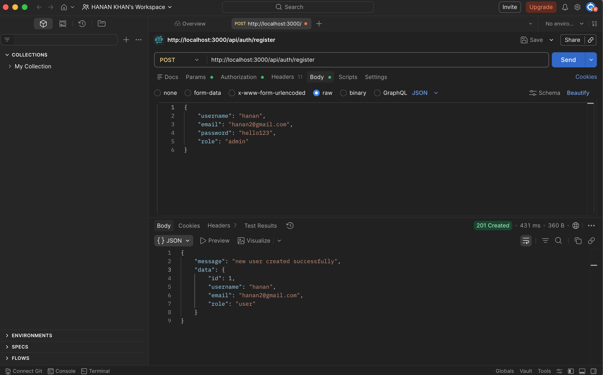
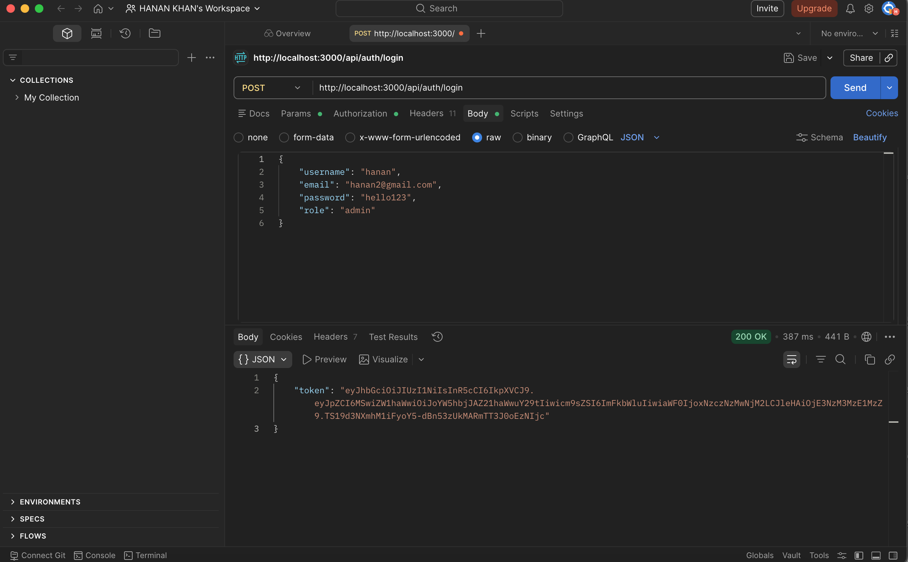
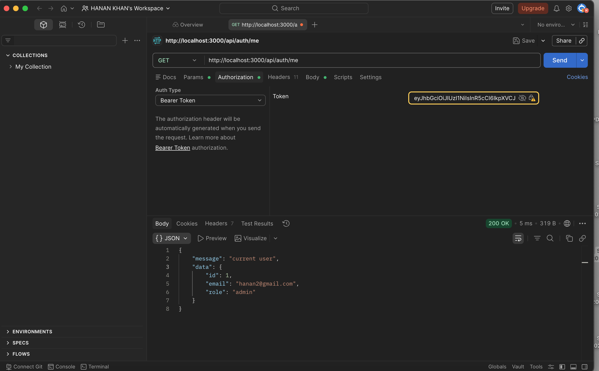
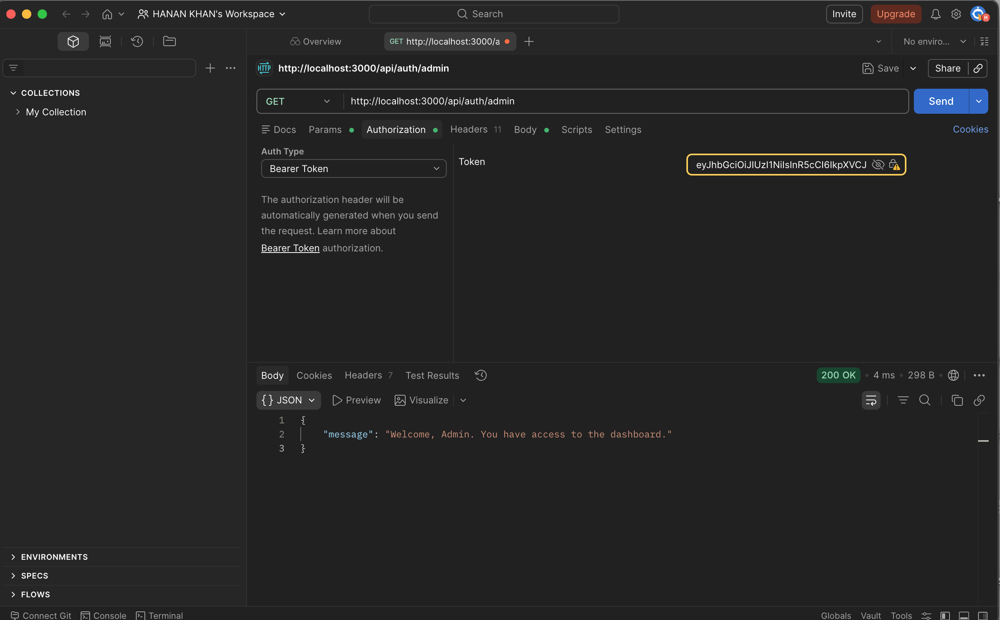
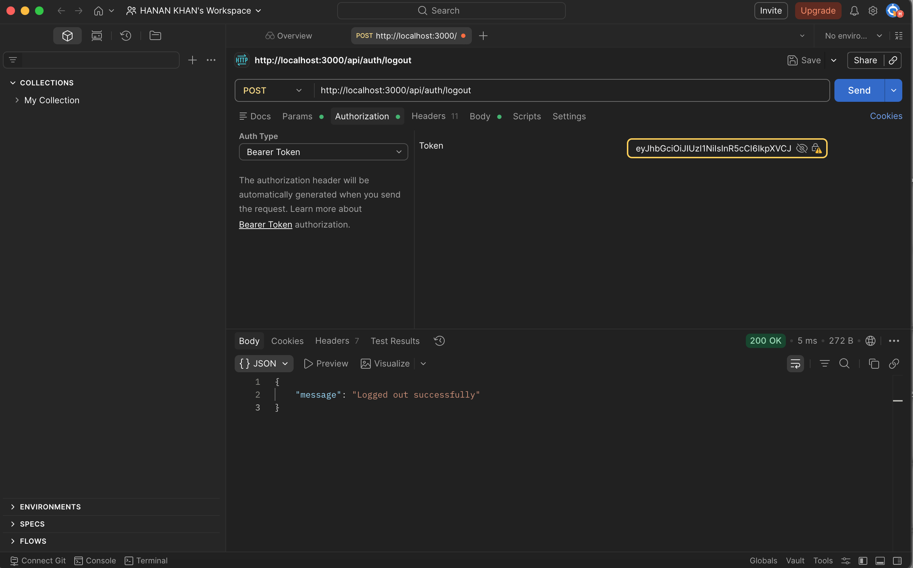
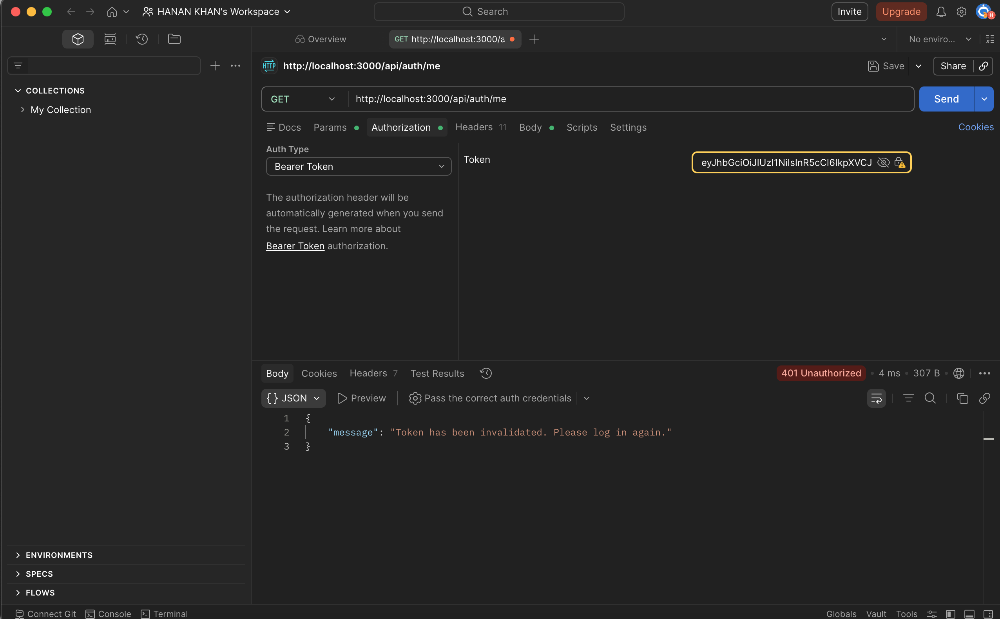

# Screenshots

## POST/ Register a new User

## POST/ Login as Registered User

## GET/ The user Logged In

## GET/ the Logged In Admin User

## GET/ the Logged In Admin or Normal User

## POST/ Logout

## GET/ Trying to Access /me after Logout

